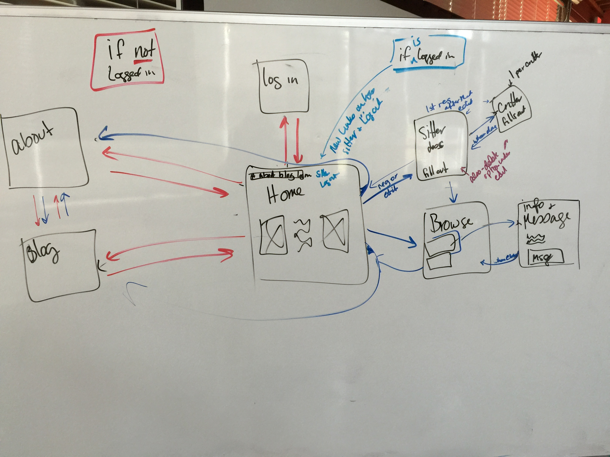

#Final Project working title: Critter Sitter

##Description
I love having pets in my life, but I also love the freedom to travel. I hated having to feel that you can do one or the other, but not both if you can't afford pet boarding. I want to help people who cannot travel with their pet to find a swapmate so they can travel with peace of mind. When I see shelters full of loving animals, I wonder about people who feel that they cannot adopt because they cannot afford to board when they travel, or 

I want to introduce people whose needs match so they can trade off pet sitting favors.

Critter Sitter allows people to describe themselves, their homes, their pet menagerie and browse profiles to find a partner to exchange pet sitting favours with the added benefit of making new friends for humans and non-humans alike.

##User Stories
[user stories](https://trello.com/b/XGPVSCna/tiy-final-project)

##Wire Frames

##Models

## APIs, Plugins, Libraries, Frameworks
Framework: Skeleton
Libraries: ReactJS, Perk
Plugins: Sass
APIs: THINKING NOT NEC FOR THIS ASSIGNMENT

