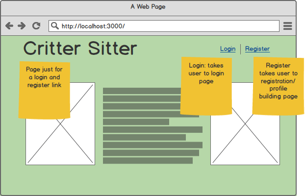
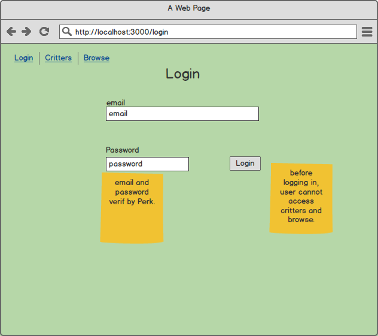
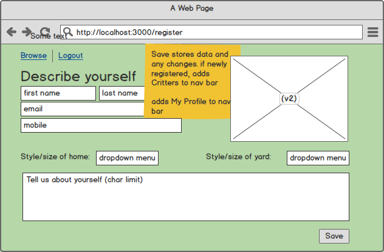
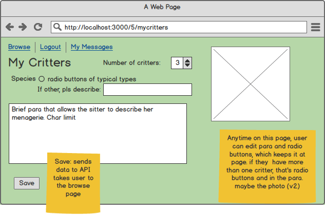
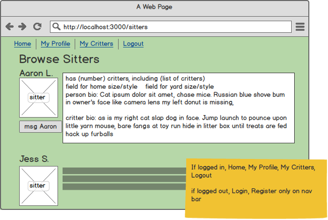
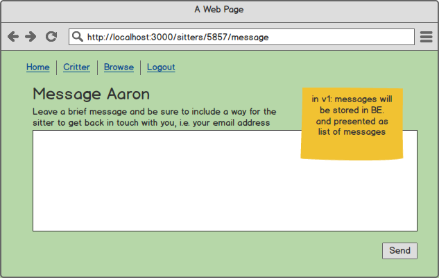
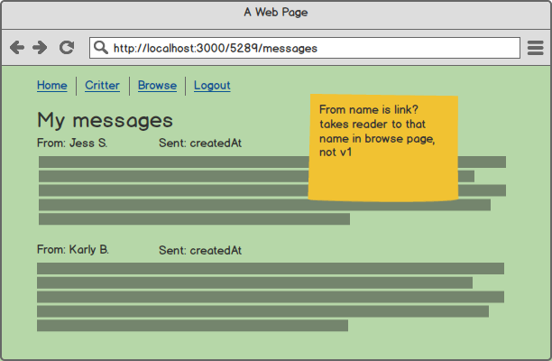
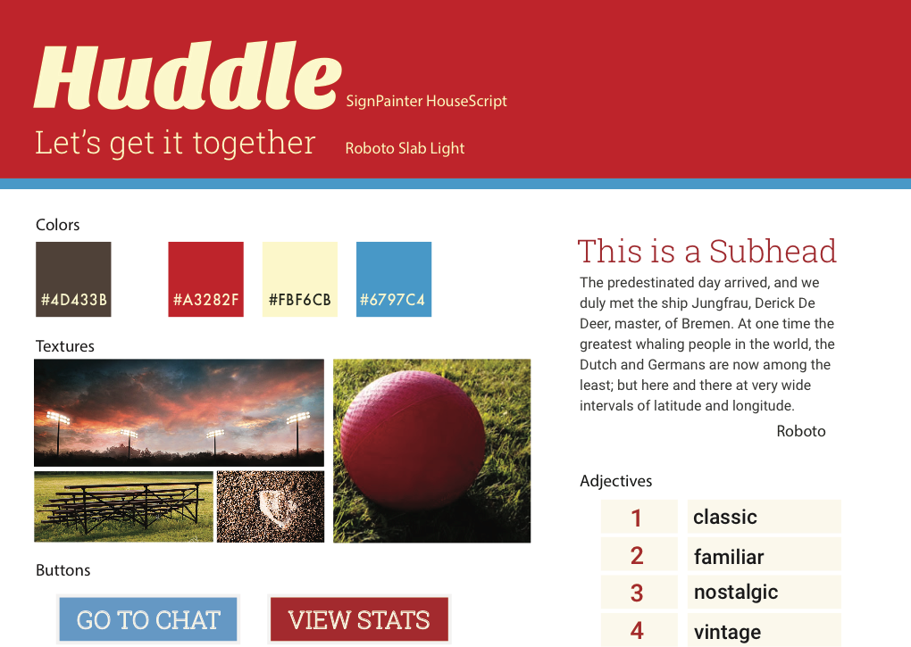
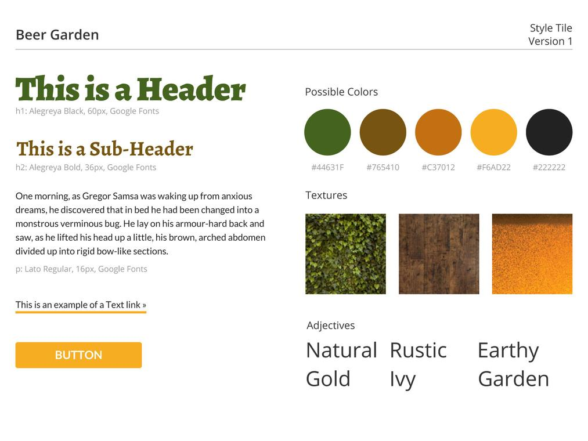

#Final Project working title: Critter Sitter

##Description
I love having pets in my life, but I also love the freedom to travel. I hated having to feel that you can do one or the other, but not both if you can't afford pet boarding. I want to help people who cannot travel with their pet to find a partner to take turns pet sitting so they can travel with peace of mind. 

Critter Sitter allows people to describe themselves and their pet menagerie and browse profiles to find a partner to exchange pet sitting favours with the added benefit of making new friends for humans and non-humans alike.

##User Stories
[user stories](https://trello.com/b/XGPVSCna/tiy-final-project)

##Wire Frames

##Models

##Style Tiles (top three to pick from) as found on [Open Tiles](http://www.opentil.es/)
Tiles by [Amalie Barras](https://github.com/amaliebarras):

Tile by [Alex MacDuff](https://github.com/amacduff)

## APIs, Plugins, Libraries, Frameworks
Skeleton, ReactJS, Perk, Bookshelf, Sass, Browserify, Backbone, Knex, PSQL, Filestack, Express
Hackpad PM group: [DAKpad](https://hackpad.com/DAKpad-v3ksBycy5Se)

